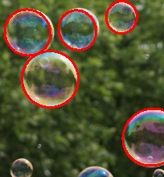

# circle detection using AAMED

## Overview

This repository focuses on circle detection using the AAMED (Arc Adjacency Matrix based Fast Ellipse Detection) algorithm. The AAMED algorithm is a robust method for detecting circular shapes in images, particularly useful in applications where precise and reliable detection is required. Thanks to the code authors. 😁

## How to Use

1. **Installation**:

   you can download library in [AAMED](https://github.com/Li-Zhaoxi/AAMED).

2. **download my Circle Detection code**:

   ```bash
   git clone https://github.com/byeol3325/circle_detection
   ```

3. **Adjusting Parameters**:

   - You can adjust the detection parameters directly in the script or by using command-line arguments. For example, to change the sensitivity of the detection, modify the following line in the script:
     ```python
     aamed.setParameters(3.1415926 / 3, 3.0, 0.77)
     ```
   - ⚠️ you have to check the **path, output_path** ⚠️
     ```python
     path = "~~~"
     output_path = "~~~"
     ```
     If there is no output_path, **output_path will be created automatically**, so don't worry. 😁

## example images


